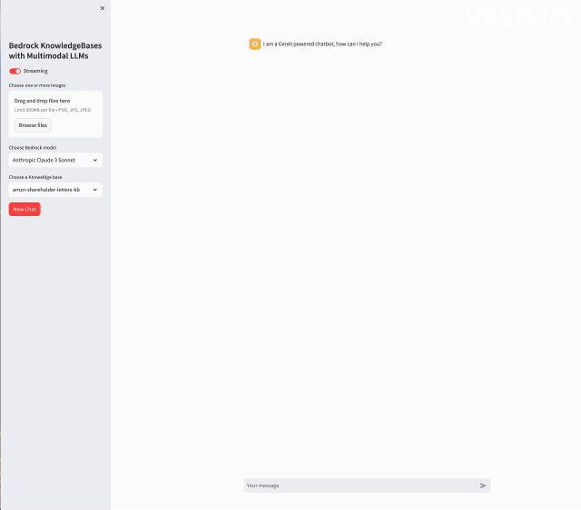

# Multimodal Chatbot with Amazon Bedrock Knowledge Bases Integration

This is a Streamlit application that combines the capabilities of [Amazon Bedrock Knowledge Bases](https://aws.amazon.com/bedrock/knowledge-bases/) with multimodal Large Language Models (LLMs). The application allows users to ask questions and receive relevant responses based on the selected knowledge base and multimodal LLM. Users can also upload images to supplement their queries.




## Installation

1. Clone the repository:
```
git clone https://github.com/aws-samples/sample-chatbot-for-bedrock-knowledge-base-and-multimodal-llms.git
cd sample-chatbot-for-bedrock-knowledge-base-and-multimodal-llms/
```

2. Create and activate a virtual environment
```
python3 -m venv venv
source venv/bin/activate
```

3. Install the required Python packages:
```
pip install -r requirements.txt
```

4. Go to AWS Console. Go to Amazon Bedrock console and on left menu, click on Model access:
    * Access to Claude Models:
       * On the Model access screen, click on button "Modify model access":
       * On "edit model access" screen, select Titan Embeddings G1 - Text and Claude 3 models (Haiku, Sonnet, Opus), and click on "Request model access" button
   * Access to Nova Models:
      * Select region "us-east-1" in the AWS console
      * On the Model access screen, click on button "Modify model access":
      * On "edit model access" screen, select Nova Micro, Nova Lite, Nova Pro, Nova Canvas and Nova Reel


6. If you want to create a new knoweldge base, take a look at the CLI tool `create_kb.py` in the `scripts/` folder
```
python scripts/create_kb.py --help 
```
In that case, you would need to have an AWS Role with the follwoing polices [here](doc/kb-polices.txt)

If you want to upload documents from local to the KnowledgeBase, add the documents to `scripts/data` folder. Otherwise, you can also specify a custom S3 bucket name to the `create_kb.py` script.

6. [Optional] You can delete the created knowledgeBase from setp 4 with the following script:
```
python scripts/delete_kb.py --knowledge_base_name <your-kb-name>
```

## Usage
1. Ensure your terminal session can access the AWS account via SSO, environment variables or any mechanism you use
2. Take a look at the `app/configs.json` to adjust different variables such as `region_name`
3. Start the Streamlit application:

```
streamlit run app/main.py
```

